# Evidencias - Proyecto Final: Página Web Foca Ice

---

## 📌 Información General

En este documento se recopilan las evidencias del desarrollo del proyecto, incluyendo capturas de pantalla relevantes y el acceso a la página desplegada en GitHub Pages.

**Nombre del proyecto:** Página Web - Foca Ice  
**Autor:** Eduardo Alfredo Cerón Maciel  
**Fecha:** 23-03-2026  
**Repositorio:** https://github.com/AlfredoCeron/PaginaWeb-Foca-Ice  
**Sitio desplegado:** https://alfredoceron.github.io/PaginaWeb-Foca-Ice/

---

## 📂 Ubicación de las evidencias

Todas las imágenes se encuentran dentro de la carpeta:

    /evidencias

> - `historial-commits.png`
> - `github-pages.png`
> - Movil
>   - `inicio.png`
>   - `productos.png`
>   - `contacto.png`
>   - `footer.png`
> - Pc
>   - `inicio.png`
>   - `productos.png`
>   - `contacto.png`
>   - `footer.png`
> - Tableta
>   - `inicio.png`
>   - `productos.png`
>   - `contacto.png`
>   - `footer.png`

---

## 🧾 Historial de Commits

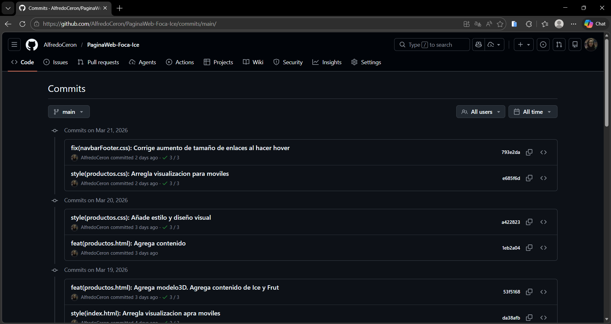

---

## 🌐 Vista de GitHub Pages

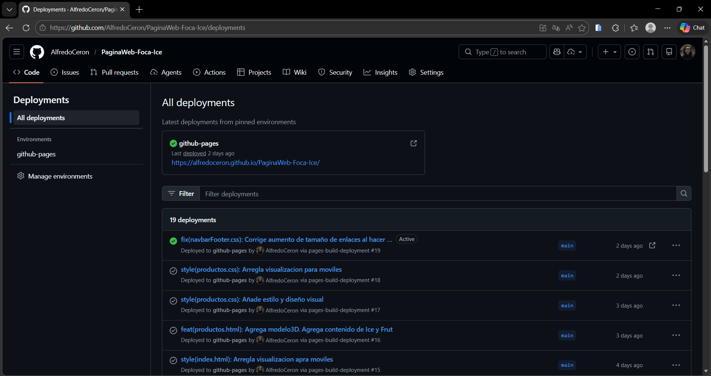

---

## 🖥️ Vista en una computadora

### Página de Inicio

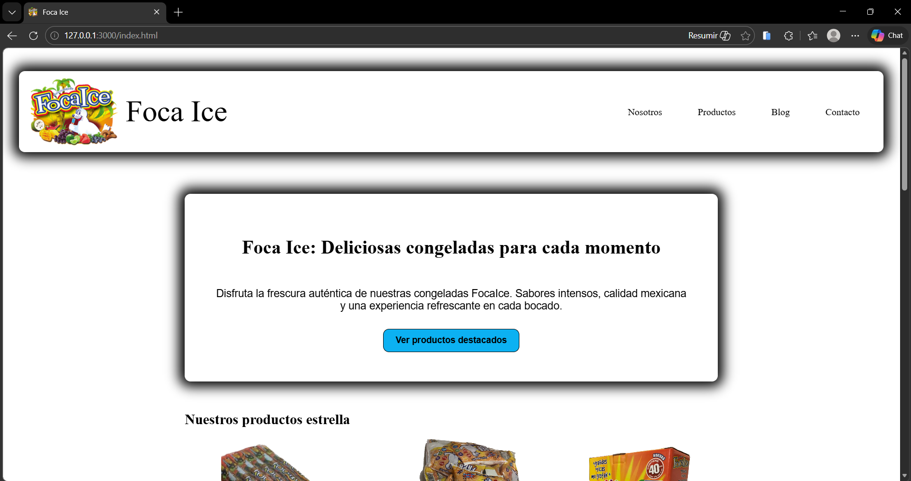

### Sección Productos

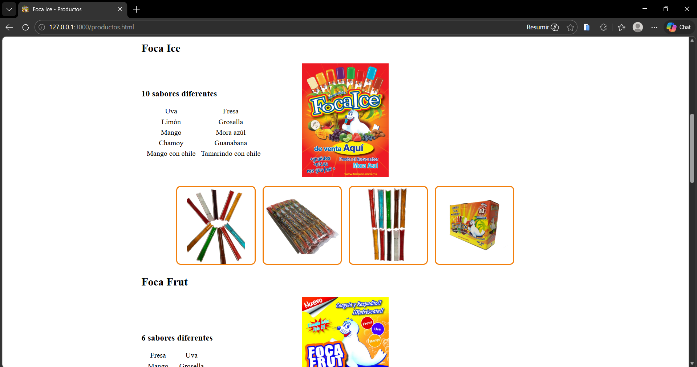

### Sección Contacto

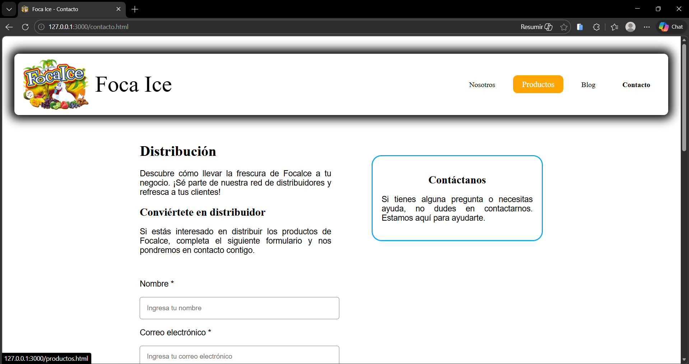

### Footer

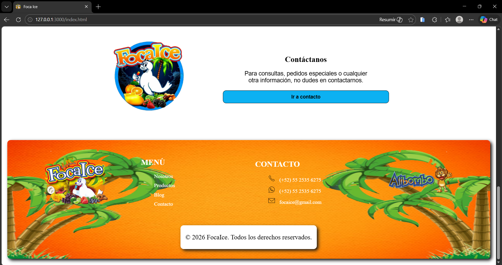

---

## 📱 Vista en un celular

### Página de Inicio

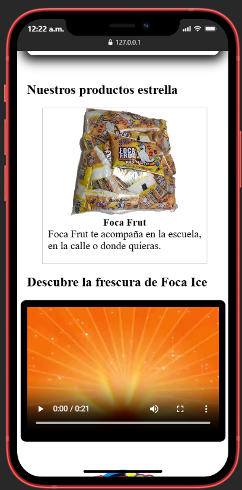

### Sección Productos

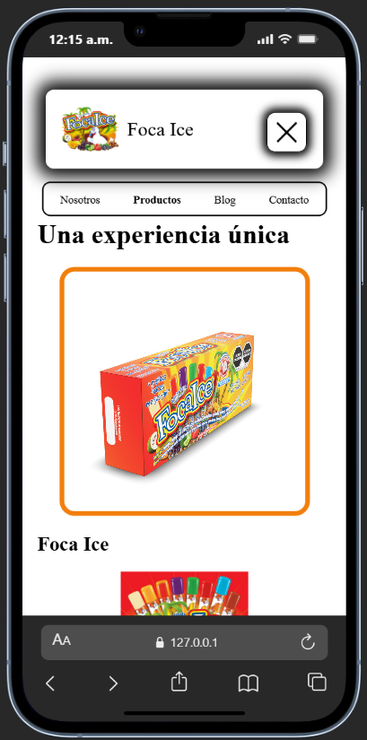

### Sección Contacto

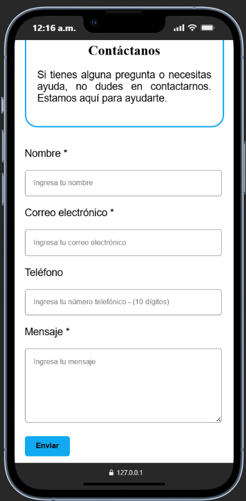

### Footer

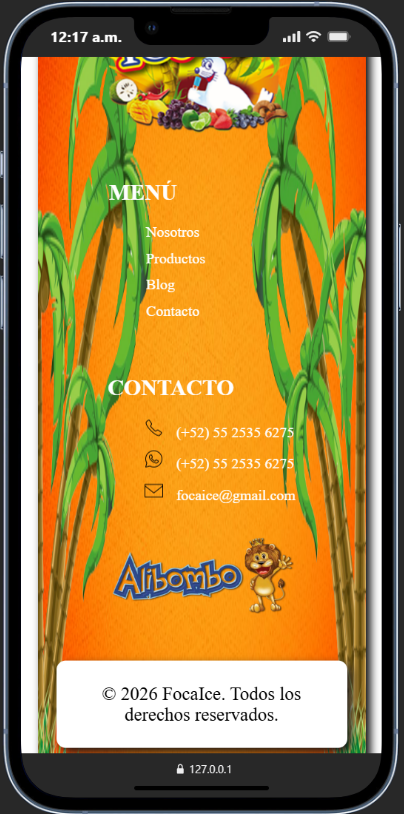

---

## 📱 Vista en una tableta

### Página de Inicio

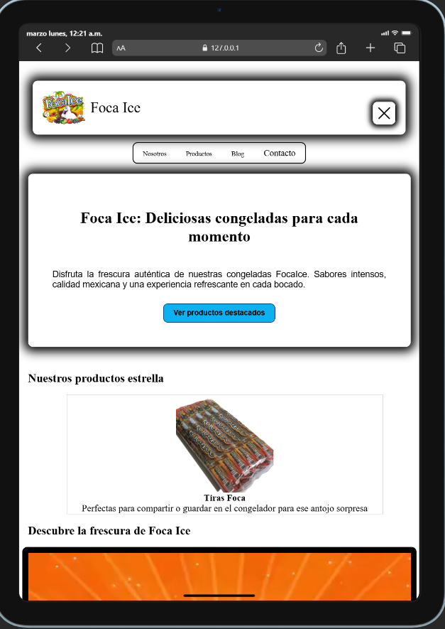

### Sección Productos

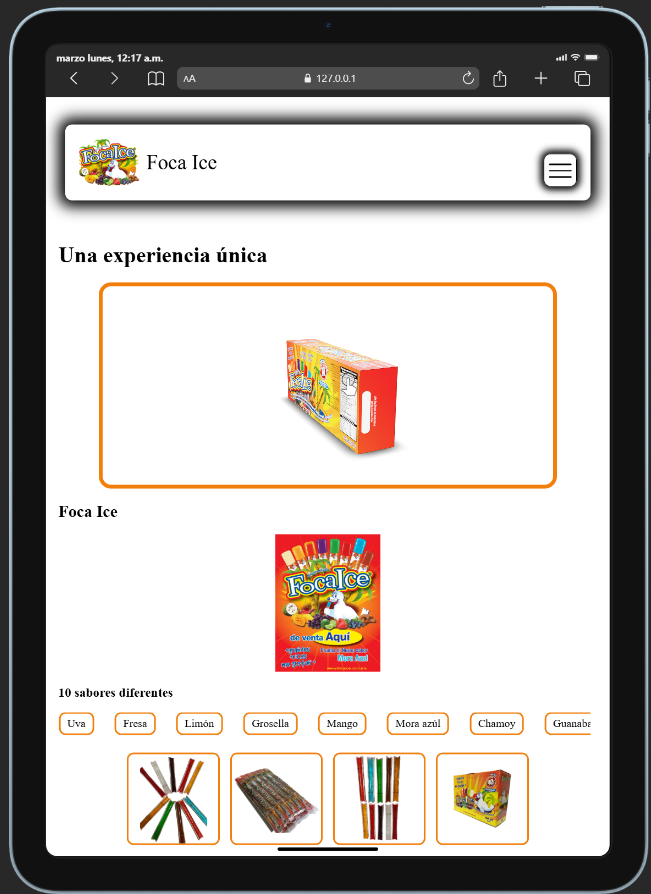

### Sección Contacto

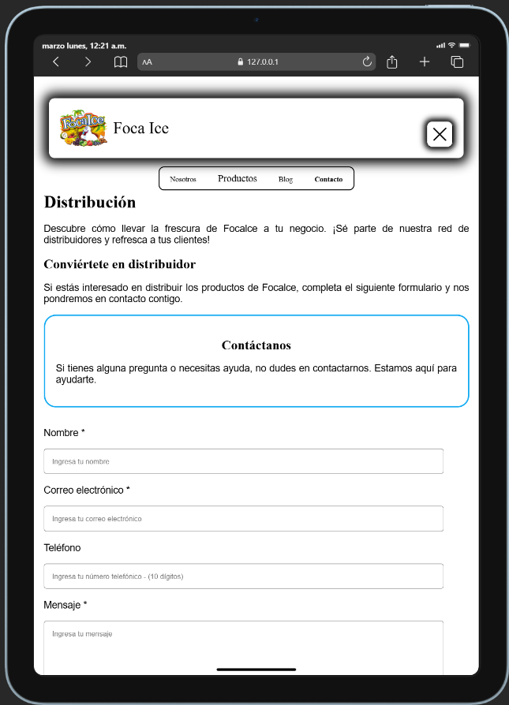

### Footer

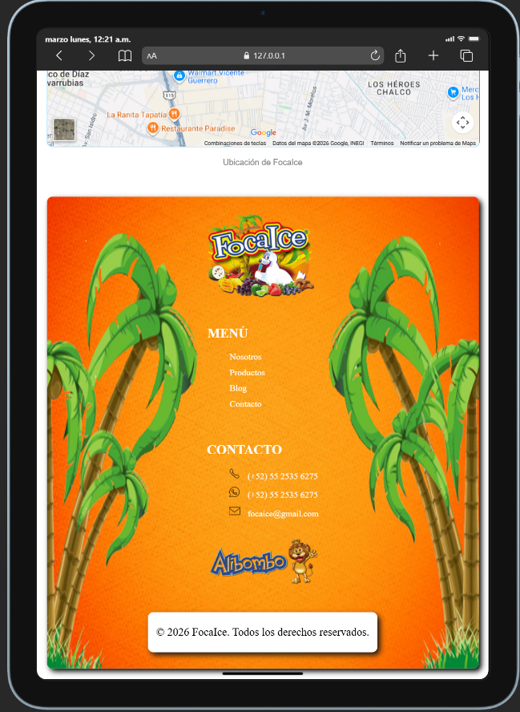

---

## 🔗 Enlace a la página desplegada

👉 **GitHub Pages:**\
`https://alfredoceron.github.io/PaginaWeb-Foca-Ice/`

---

## 🔗 Enlace al respositorio

👉 **GitHub:**\
`https://github.com/AlfredoCeron/PaginaWeb-Foca-Ice`

---

# Aprendizajes

## 1. ¿Qué fue lo más fácil y lo más retador del proyecto?

_Lo más sencillo fue definir la jerarquía del contenido (menú de navegación, footer, pestañas como Contacto, Productos, Inicio, etc.) pues tomé como ejemplos y referencias a otros sitios web; asimismo fue muy intuitivo el formulario en la pestaña Contactos y considerar qué preguntas son necesarios y cuáles pueden omitirse su respuesta. Incluir el modelo 3D igual resultó bastante sencillo pues un vídeo en Youtube explica de forma rápida y concisa su implementación._

_Por otro lado, lo más retador del proyecto fue lograr un diseño más dinámico y visualmente atractivo, especialmente la responsividad y las animaciones para que no pierdan la misma esencia visual tanto en computadora como en móvil. Además, un gran desafío fue incluir el manú de navegación "hamburgesa" pues no tengo conocimientos en JS, tuve que ver varios vídeos y documentaciones para después acoplar esa información a mi proyecto._

---

## 2. ¿Qué partes de HTML semántico y Flexbox usaste y por qué?

_Entre las principales etiquetas empleadas se encuentran `<header>` para definir la parte superior de la página que contiene el logo y la navegación; `<nav>` para agrupar los enlaces de navegación; `<section>` para dividir el contenido en bloques temáticos y `<footer>` para la información final del sitio y que funcione como navegación. Utilizar estas etiquetas permite mejorar la accesibilidad, el SEO, el mantenimiento y legibilidad del código._

_Referente a Flexbox, se utilizó para la distribución y alineación de los elementos en la interfaz. Por ejemplo, `display: flex` en contenedores para organizar los elementos de forma horizontal, como el menú de navegación. Igual se utilizaron propiedades como `align-items` para la alineación vertical y `justify-content` para la alineación horizontal. `flex-wrap` se pensó para el cambio automático de las disposiciones al visualizarse en pantallas más pequeñas_

---

## 3. ¿Cómo organizaste tus media queries y breakpoints?

_El proyecto se realizó con un efoque desktop-first, por lo que las media queries refieren a la visualización en móviles; sin embargo, se utilizó un `max-width: 820px` para incluir tanto celulares hasta tabletas (excluyendo el tamaño de un iPad PRO 11)._

_No se manejaron más breakpoints pues al tener un diseño simple se consideró que la diferencia visual más notoria sería el menú de navegación hamburgesa, y tanto en móviles como tabletas por su anchura de pantalla el scroll debe ser vertical por lo que con solo centrar los elementos y manejar todo en una sola columna bastaría._

---

## 4. ¿Qué mejorarías en una siguiente versión?

_Inlcuiré la interación del fórmulario de la pestaña Contactos para que envíe las respuestas del usuario a un correo electrónico ya que actualmente solo tiene funcionalidad visual._

_También haré que el texto de sabores de Foca Ice y Foca Frut en la pestaña Productos, que actualmente maneja un scroll, sea un scroll automatico infinito. Investigué en internet posibles soluciones, como utilizar la etiqueta "marquee", codificación en JS o directamente en CSS con div anidados._

_Finalmente, concluiré la página web ya que actualmente las pestañas Nosotros y Blog no existen. Aún no tengo un diseño pues requiero de texto e imágenes a incluir._

---

---

**Documento elaborado como parte del Proyecto Final de Desarrollo Web.**
